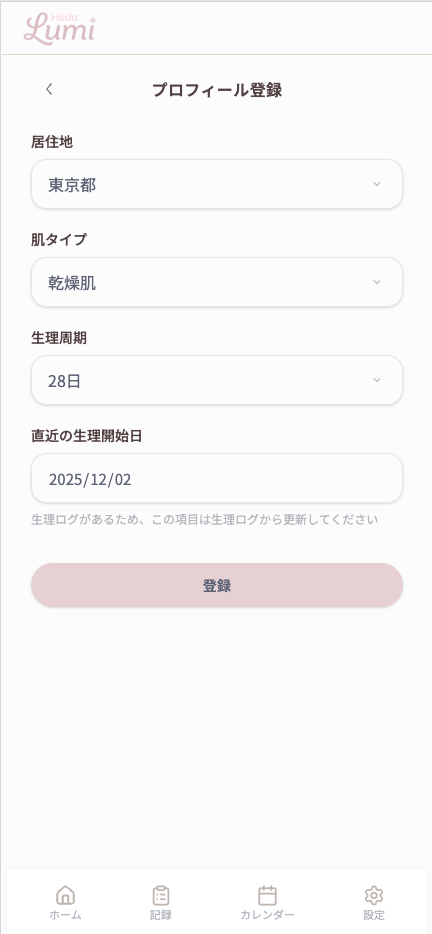
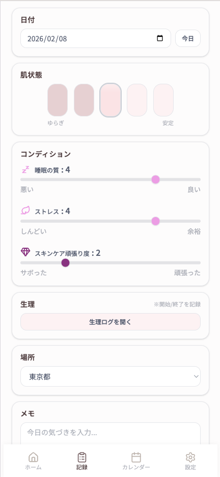
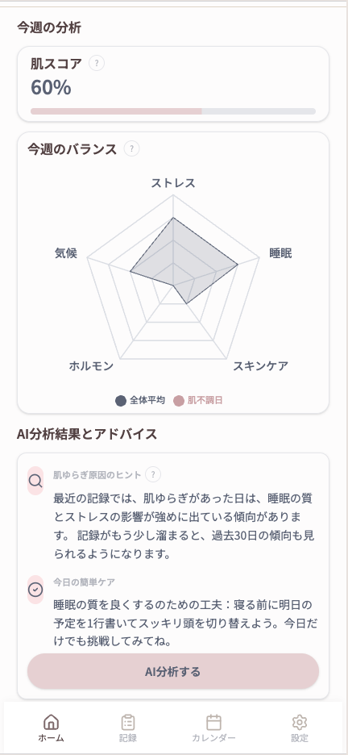
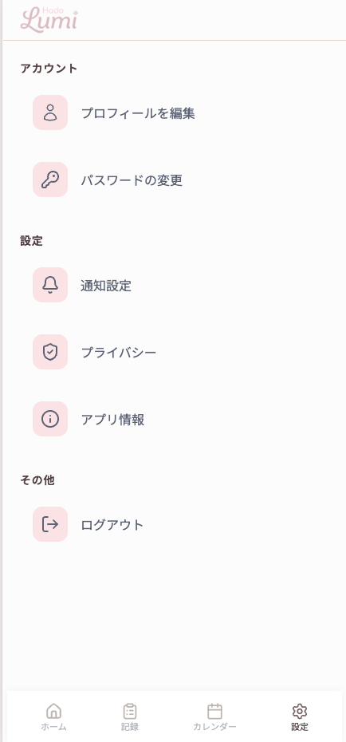

# Hada Lumi

[](https://github.com/Ino-12345/HadaLumi/actions/workflows/backend-ci.yml)
[](https://github.com/Ino-12345/HadaLumi/actions/workflows/frontend-ci.yml)

肌状態と生活ログを記録し、AIで肌ゆらぎの原因を分析・可視化するWebアプリです。

「忙しくても記録は続けたい」「肌荒れの原因を知りたい」  
そんなユーザーのために開発しました。

---

## 🌐 デモ環境

デモURL：
https://hada-lumi.vercel.app/

※初回アクセス時はサーバー起動に30〜60秒ほど時間がかかる場合があります。
（無料ホスティング環境のため）

【ログイン方法】
Googleログインが利用可能です。
お手持ちのGoogleアカウントでログインしてください。


## 🎥 デモ動画

https://youtu.be/HyM0ali2qa4

※想定ユーザー（ペルソナ）が利用する流れをイメージしたデモ構成です。

---

## 📱 アプリ概要

Hada Lumi は、肌ゆらぎに悩むユーザーが  
短時間で記録し、原因のヒントに気づける体験を目指したWebアプリです。

仕事や日々の生活で忙しく、記録が続かない人でも  
無理なく記録と振り返りができる設計を重視しました。

---

## 🚀 主な機能

- 日次記録（肌状態・睡眠・ストレス・スキンケアなど）
- カレンダーによる振り返り
- レーダーチャートでの傾向可視化
- OpenAI APIによるAI分析
- 気候データの自動取得・反映

---

## 🛠 技術スタック

### Frontend
- Next.js (App Router)
- React / TypeScript
- Tailwind CSS

### Backend
- FastAPI
- SQLAlchemy
- Python 3.11

### DB / Cache
- PostgreSQL
- Redis

### Auth
- Firebase Authentication

### Infra / CI
- Docker / Docker Compose
- GitHub Actions

### AI
- OpenAI API

---

## 👩‍💻 担当領域

チーム開発プロジェクトとして開発しました。

私は主に以下を担当しました：

- FastAPIによるAPI設計・実装
- DB設計・モデル実装
- AI分析ロジック設計・プロンプト最適化
- Redisキャッシュ実装
- 認証トークン検証処理
- 一部フロント実装

---

## 💡 工夫した点
- 記録の継続性: 忙しいユーザーが記録を続けやすいよう操作負荷を下げる入力設計
- カレンダーUI: 小さい日付セルでも情報過多にならない表示切替と視認性改善
- AI分析の安定化: FastAPI 側でデータを先に構造化し、応答の速度と一貫性を改善
- 品質保証: GitHub ActionsによるCI導入

---

## 🖼 画面イメージ

以下の主要画面を実装しています：

### ログイン


### プロフィール登録


### 日次記録


### 生理記録


### ホーム（レーダーチャート・AI分析）


### カレンダー


### 設定（プロフィール編集・ログアウト）

---

## 👥 開発体制

4人チームでの開発（8週間）

---

## ⚙️ セットアップ（開発者向け）
前提:

- Docker / Docker Compose
- Node.js / npm

1. リポジトリを取得

```bash
git clone <REPOSITORY_URL>
cd <REPOSITORY NAME>
```

2. 環境変数を設定

- ルート: `.env`（DB, Redis, CORS など）
- フロント: `frontend/.env.local`（Firebase, API URL など）
- バック: `backend/.env`（必要に応じて）

3. バックエンドを起動

```bash
docker compose up -d
```

API Docs: `http://localhost:8000/docs`

4. フロントエンドを起動

```bash
cd frontend
npm install
npm run dev
```

App: `http://localhost:3000`

## ディレクトリ構成

```text
frontend/   # Next.js アプリ
backend/    # FastAPI アプリ
db/seed/    # DB 初期データ
```
